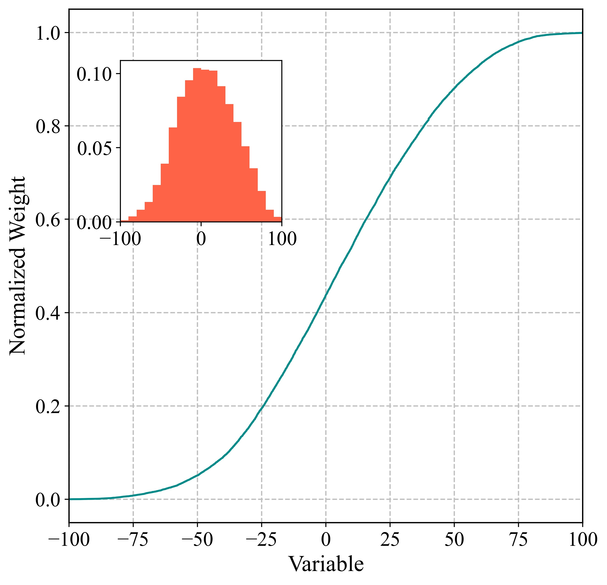
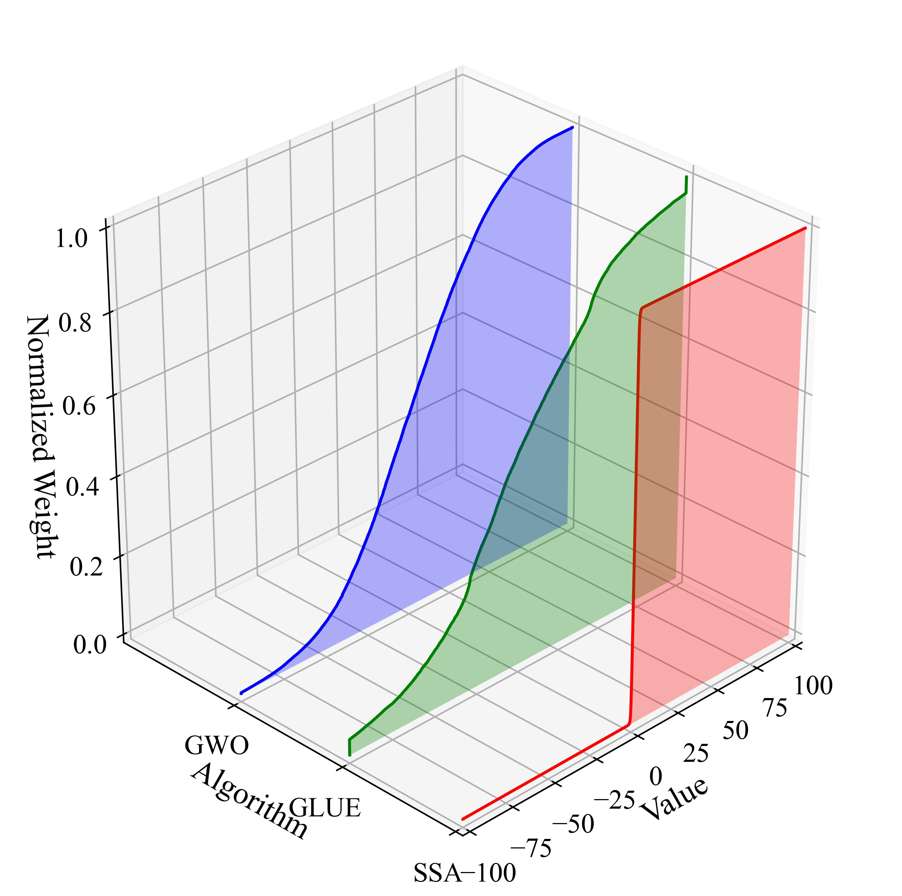
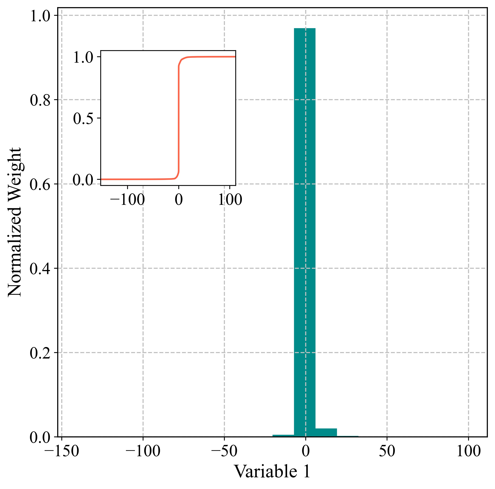
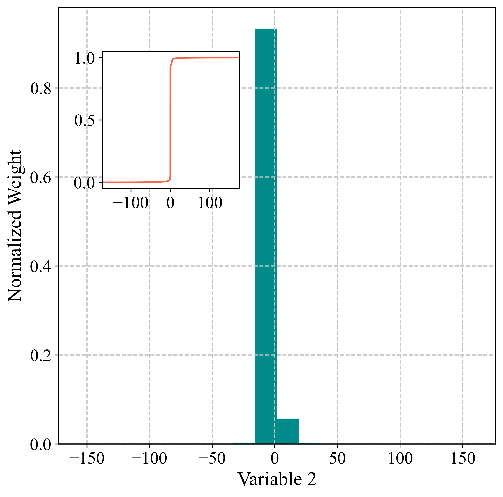
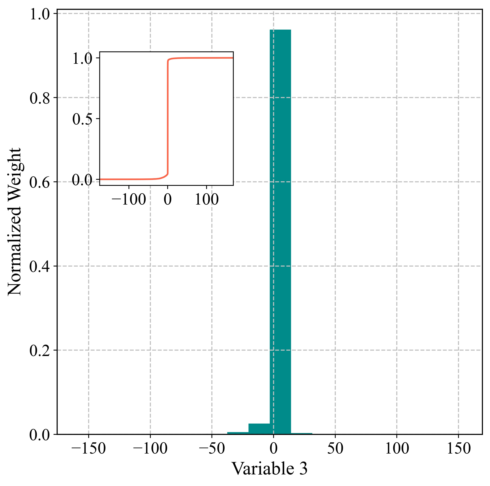
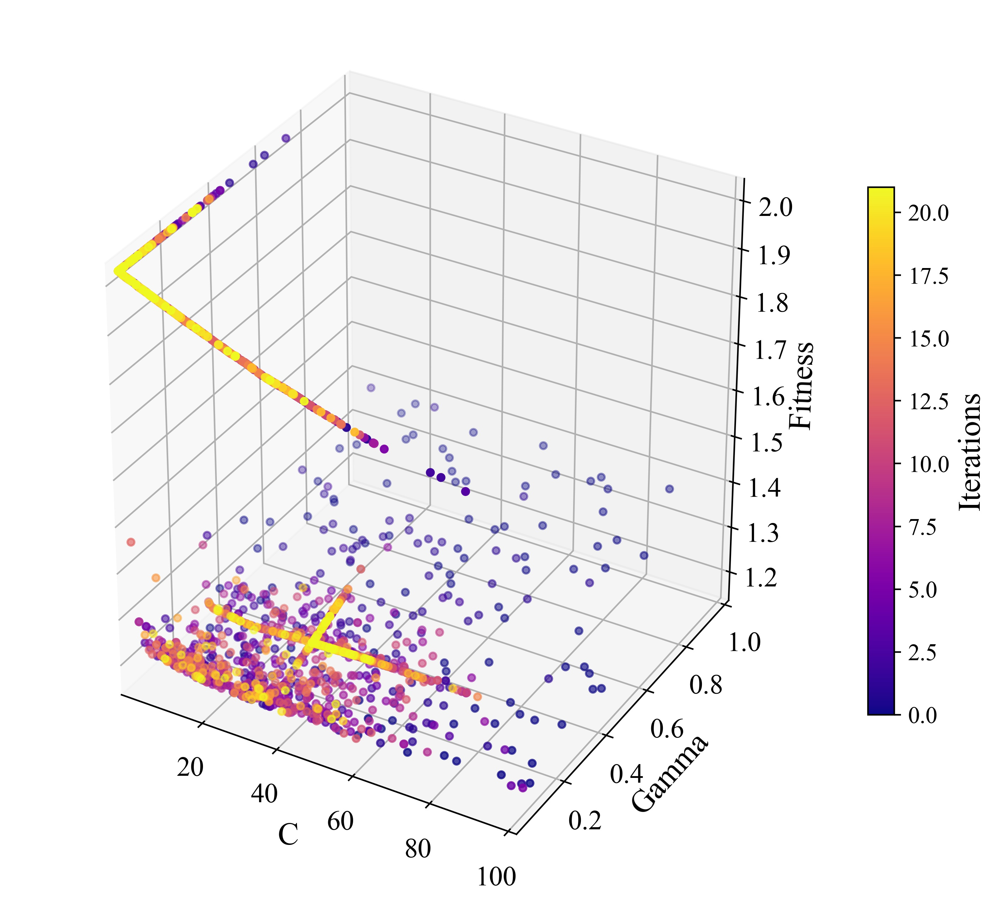
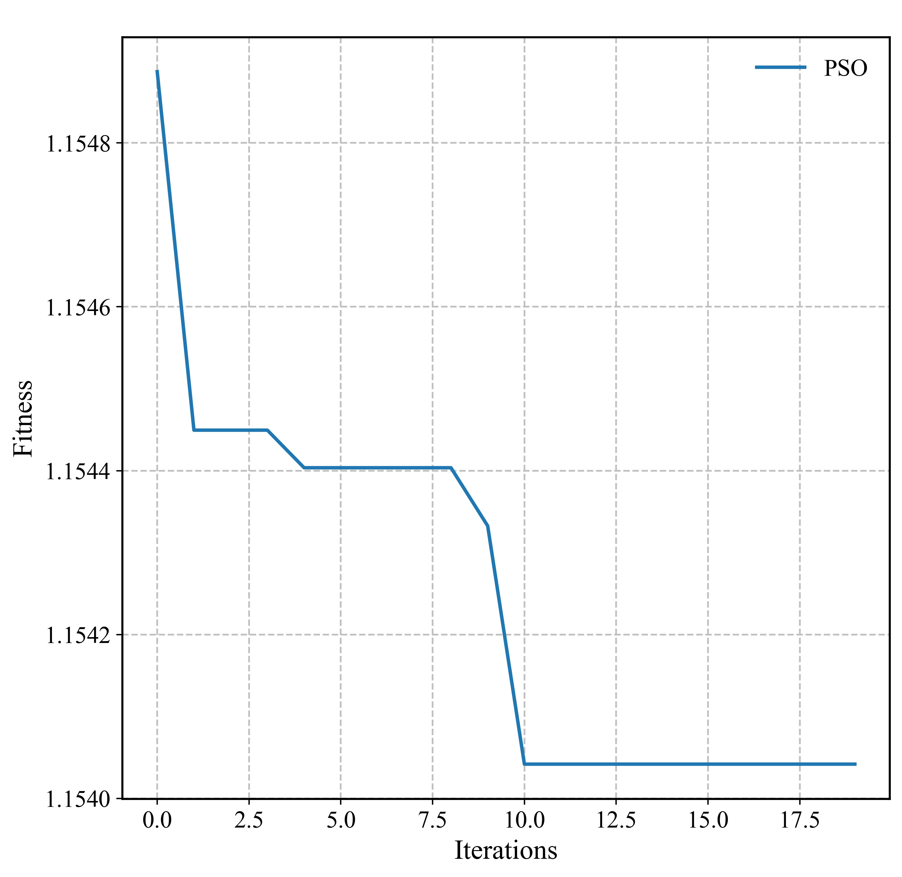

# PyCUP--0.1.2.1 documentation


[TOC]

## Overview

​	pycup is a python package for parameter optimization and uncertainty analysis of different kinds of models, such as machine learning models, hydrological models, and water quality models. Version 0.1.0 is the very first version of this package, and it will be improved continuously. Eleven swarm optimization algorithms (8 single-objective algorithms and 3 multi-objective algorithms) and GLUE (Generalized Likelihood Uncertainty Estimation) have been encapsulated in this version. When applying swarm optimization algorithms, this package considers parameter uncertainty instead of only obtaining the parameter with the best simulation performance in the calibration stage. Also, several improvements, including elite opposition theory and Latin hypercube sampling, have been integrated into those algorithms.

## Who uses PyCUP?

​	Engineers, modelers,and researchers who are constructing models (especially hydrological models, hydraulic models, and water quality models) and want to quantify the parameter uncertainty. The functions of the package are especially compatible with environmental models, although it can also be used in other realms.

## Open-access package

​	pycup is a free python package. Users can redistribute it and/or modify it under the terms of the license. We welcome contributions from the community. Also, we welcome feedbacks for any potential errors in the package. 

## Install

​	Please visit  pypi.org to download the .whl file, or simply install it using:

```
pip install pycup
```

## Dependencies

1. python > 3.0
2. numpy
3. scipy
4. matplotlib
5. pyDOE
6. statsmodels
7. multiprocessing
8. Anaconda 3 environment is strongly recommended

## Project structure

1. Algorithms

    | Module name | Description                                                  |
    | ----------- | ------------------------------------------------------------ |
    | GLUE.py     | Includes generalized likelihood uncertainty estimation method (1992) and its multi-processing version. |
    | SSA.py      | Includes sparrow search algorithm (2020) and its multi-processing version. |
    | GWO.py      | Includes gray wolf optimization algorithm (2014) and its multi-processing version. |
    | MFO.py      | Includes moth-flame optimization algorithm (2015) and its multi-processing version. |
    | PSO.py      | Includes particle swarm optimization (1995) and its multi-processing version. |
    | SCA.py      | Includes sine cosine algorithm (2016) and its multi-processing version. |
    | SOA.py      | Includes seagull optimization algorithm (2019) and its multi-processing version. |
    | TSA.py      | Includes tunicate swarm algorithm (2020) and its multi-processing version. |
    | WOA.py      | Includes whale optimization algorithm (2016)  and its multi-processing version. |
    | MOPSO.py    | Multi-objective PSO and its multi-processing version based on non-dominated sort and archive. |
    | MODE.py     | Multi-objective differential evolution algorithm (2007) and its multi-processing version. |
    | NSGA2.py    | Non-dominated sorting genetic algorithm (2000) and its multi-processing version. |
    
2. Calculation Auxiliaries & Post-processing

    | Module name                 | Description                                                  |
    | --------------------------- | ------------------------------------------------------------ |
    | evaluation_metrics.py       | Includes several popular evaluation metrics such NSE, MAE, RMSE. |
    | sampling.py                 | Includes the function for Latin hypercube sampling for population initialization. |
    | plot.py                     | Includes functions for plotting posterior distributions, 95PPU bands, fitness curves, and sample spaces. |
    | uncertainty_analysis_fun.py | Includes functions for calculating the posterior distribution, uncertainty bands, and uncertainty evaluation metrics such as P factor and R factor. |
    | utilize.py                  | Includes validator and predictor objects for validation and prediction related utilizations. |

3. Others

    | Module name       | Description                                                  |
    | ----------------- | ------------------------------------------------------------ |
    | multi_jobs.py     | Functions for parallel calculations.                         |
    | progress_bar.py   | Functions for showing a progress bar.                        |
    | test_functions.py | CEC and author-defined testing functions.                    |
    | save.py           | Contains RawResult and OptResult saver objects.              |
    | utilize.py        | Validator and Predictor object for validation and prediction. |
    | template.py       | Template functions for advanced utilization of pycup.        |

## Tutorial

### Importing the package and other dependencies

```python
import pycup as cp
import numpy as np
```

### Defining an/a objective function/likelihood function

​	To use the optimization algorithms, firstly you should have an objective function (the optimization target). The function should have an X parameter, which is a numpy 1D array that contains all the parameters that you want to optimize. The function should contain 2 return values including the fitness value  and the result 2D array.
$$
fitness= ∑x_i^2
$$


```python
def uni_fun1(X):
	# X for example np.array([1,2,3,...,30])
    fitness = np.sum(np.power(X,2)) + 1 # example: 1.2
    result = fitness.reshape(1,-1) # example ([1.2,])

    return fitness,result
```

### Defining the parameter upper & lower boundaries

​	The upper and lower boundaries should be 1D numpy array.

```python
lb = -100 * np.ones(30)
ub = 100 * np.ones(30)
```

### Enjoy our algorithms

​	The pop denotes the population size in each iteration, dim is the dimension of the parameter space (30 in this example), lb is the lower bound, ub is the upper bound, Max_iter is the number of optimization iterations. The raw(optimization) data results (RawResult.rst) will be saved in your project folder. If you only want the best result and do not consider the parameter uncertainty, that is all you need.

```python
cp.SSA.run(pop = 1000, dim = 30, lb = lb, ub = ub, MaxIter = 30, fun = uni_fun1)
```

​	For multi-objective optimization using MOPSO, the required arguments are slightly different:

```python
import pycup as cp
import numpy as np

def mo_fun1(X):
    y1 = 1 - np.exp(-np.sum((X-1/np.sqrt(3))**2))
    y2 = 1 - np.exp(-np.sum((X+1/np.sqrt(3))**2))
    y3 = 1 - np.exp(np.sum((X**2 + np.sqrt(2))))
    fitness = np.array([y1,y2,y3]).reshape(1,-1)
    result = fitness
    return fitness,result

lb = np.array([-2, -2, -2])
ub = np.array([2, 2, 2])
cp.MOPSO.run(pop=100, dim=3, lb=lb, ub = ub, MaxIter=20,
             n_obj=3,nAr=300,M=50,fun=mo_fun1)
```

### Save & Load the results

​	The results are automatically saved in two binary files, which are "RawResult.rst" and "ProcResult.rst". Those files are located in your python project root folder. Also, users can define their specific result path and format.

#### Raw results

​	Users can load the binary raw result file using the "RawResultSaver" object in the module "pycup.save". The returned value is a saver object that contains different unprocessed data including the historical samples generated by the algorithm. Users can also plot the sample spaces or fitness spaces directly using the functions in "pycup.plot" and this saver object (this will be introduced later). To load the raw result with default path and format:

```python
from pycup import save

raw_res = save.RawDataSaver.load(r"RawResult.rst")
```

​	To define and load a raw result file:

```python
from pycup import save
import pycup as cp
import numpy as np

def uni_fun1(X):
	# X for example np.array([1,2,3,...,30])
    fitness = np.sum(np.power(X,2)) + 1 # example: 1.2
    result = fitness.reshape(1,-1) # example ([1.2,])

    return fitness,result

lb = -100 * np.ones(30)
ub = 100 * np.ones(30)
save.raw_path = r"D:\example01.txt"
cp.SSA.run(pop = 1000, dim = 30, lb = lb, ub = ub, MaxIter = 30, fun = uni_fun1)
raw_res = save.RawDataSaver.load(r"D:\example01.txt")
```

​	A raw result saver object includes the following attributes:

| Attribute name                   | Description                                                  | Data Type    | Format/Shape                                                 |
| -------------------------------- | ------------------------------------------------------------ | ------------ | ------------------------------------------------------------ |
| .historical_samples              | The historical parameter samples generated by the algorithm. | numpy array  | (iterations, pop, dim) for swarm opt algorithms; (iterations, dim) for GLUE |
| .historical_fitness              | The fitness/likelihood function values of the corresponding samples. | numpy array  | (iterations, pop, 1) for swarm opt algorithms; (iterations, 1) for GLUE |
| .historical_results              | The simulation/calculation results of the corresponding samples. | numpy  array | (iterations, pop, len(res)) for swarm opt algorithms; (iterations, len(res)) for GLUE |
| .GbestScore                      | The fitness value of the best  sample found by the algorithm. | float        | -                                                            |
| .GbestPosition                   | The  best parameter  sample found by the algorithm.          | numpy  array | (dim)                                                        |
| .Curve (GLUE doesn't have)       | The optimization curve                                       | numpy  array | (iterations,)                                                |
| .pareto_samples (only for MOPSO) | Samples of the Pareto optimal result set.                    | numpy  array | (num. Pareto results, dim)                                   |
| .pareto_fitness (only for MOPSO) | Fitness of the Pareto optimal result set.                    | numpy  array | ((num. Pareto results, 1)                                    |
| .pareto_results (only for MOPSO) | Pareto optimal result set.                                   | numpy  array | (num. Pareto results, pop, len(res))                         |

​	Users can extract the data from the raw result saver object by:

```python
import pycup as cp

raw_res = cp.save.RawDataSaver.load(r"RawResult.rst")
hs = raw_res.historical_samples
print(hs)
```

#### Processed uncertainty analysis results

​	Users can load the binary optimization result file using the "ProcResultSaver" object in the module "pycup.save". The returned value is a saver object that contains different processed data including the historical results, posterior distributions, and uncertainty bands. Users can also plot the posterior distributions or uncertainty bands directly using the functions in "pycup.plot" and this saver object (this will be introduced later). To load the processed optimization results:

```python
import pycup as cp

opt_res = cp.save.ProcResultSaver.load(r"ProcResult.rst")
```

​	To define and load an opt result file:

```python
from pycup import save

save.proc_path = r"D:\example02.txt"
opt_res = save.ProcResultSaver.load(r"D:\example02.txt")
```

​	An optimization result saver contains the following attributes:

| Attribute name                  | Sub attribute       | Description                                                  | Data type    | Format/shape                                                 |
| ------------------------------- | ------------------- | ------------------------------------------------------------ | ------------ | ------------------------------------------------------------ |
| .historical_results             | .historical_samples | The concatenated historical samples.                         | numpy array  | (iterations * pop, dim) for swarm opt; (iterations, dim) for GLUE |
|                                 | .historical_fitness | The concatenated historical fitness values.                  | numpy array  | (iterations * pop, 1) for swarm opt; (iterations, 1) for GLUE |
|                                 | .histroical_results | The concatenated historical simulation results.              | numpy array  | (iterations * pop, len(result)) for swarm opt; (iterations, len(result)) for GLUE |
| .best_result                    | .best_sample        | The sample with the best fitness value.                      | numpy .array | (, dim)                                                      |
|                                 | .best_fitness       | The best fitness value.                                      | float        | -                                                            |
|                                 | .best_result        | The simulation result calculated using the best parameter sample. | numpy array  | (1, len(result))                                             |
| .behaviour_results              | .behaviour_samples  | The selected samples according the user defined threshold value. Typically, a sample with a fitness value lower (better) than the threshold is defined as a behaviour sample. | numpy array  | (n_behaviour, dim)                                           |
|                                 | .behaviour_fitness  | The fitness of selected behaviour samples.                   | numpy array  | (n_behaviour, )                                              |
|                                 | .behaviour_results  | The results of selected behaviour samples.                   | numpy array  | (n_behaviour, len(result))                                   |
|                                 | .normalized_weight  | The normalized likelihood weights of selected behaviour samples. | numpy array  | (n_behaviour, )                                              |
| .posterior_results              | .sorted_sample_val  | The sorted behaviour samples according to the sample value.  | numpy array  | (n_behaviour, dim)                                           |
|                                 | .cum_sample         | The accumulative weights of sorted samples.                  | numpy array  | (n_behaviour, dim)                                           |
| .uncertain_results              | .result_sort        | The sorted results of selected behaviour samples according to the magnitude of the result value at each step. (for time series sim.) | numpy array  | (n_behaviour, len(result))                                   |
|                                 | .cum_weight         | The accumulative weights of sorted results at each step.     | numpy array  | (n_behaviour, dim)                                           |
|                                 | .ppu_line_lower     | The lower boundary of the user defined confidence level (typically 95PPU) | numpy array  | (, len(result))                                              |
|                                 | .ppu_line_upper     | The upper boundary of the user defined confidence level (typically 95PPU) | numpy array  | (, len(result))                                              |
|                                 | .line_min           | The minimum values of the simulated                          | numpy array  | (, len(result))                                              |
|                                 | .line_max           | The maximum values of the simulated results of all the  behaviour samples. | numpy array  | (, len(result))                                              |
| .pareto_result (only for MOPSO) | .pareto_samples     | Samples of the Pareto optimal result set.                    | numpy array  | (num. Pareto results, dim)                                   |
|                                 | .pareto_fitness     | Fitness of the Pareto optimal result set.                    | numpy array  | ((num. Pareto results, 1)                                    |
|                                 | .pareto_results     | Pareto optimal result set.                                   | numpy array  | (num. Pareto results, pop, len(res))                         |

​	Users can extract and print the data from the opt result saver object by:

```python
import pycup as cp

opt_res = cp.save.ProcResultSaver.load(r"ProcResult.rst")
ppu_l = opt_res.uncertain_results.ppu_line_lower
print(ppu_l)
```

### Determine the global optimum of the multi-objective optimization results-- the TOPSIS method

​	Typically, the optimization/calibration result of a multi-objective algorithm is a set of non-dominated solutions called the Pareto front. The most desired solution, namely the global optimum, can be determined by the TOPSIS method from the obtained Pareto front. Pycup provides a module named TOPSIS.py to carry out the TOPSIS analysis for the multi-objective optimization. 

​	To perform a simple TOPSIS analysis, the user can use this function:

```python
import pycup as cp
# load your multi-objective optimization result.
res = cp.save.RawDataSaver.load(r"raw00.rst")
# TOPSIS analysis, the argument "weights" is optional.
opt_fit,idx_best,score,scores = topsis(res.pareto_fitness, weights=[0.5,0.5])
print(opt_fit)	# The determined global optimum
print(idx_best)	# The index of it in the given Pareto front
print(score)	# The TOPSIS score of the global optimum
print(scores)	# The TOPSIS scores of the solutions in the Pareto front
```

​	Users can use another approach to carry out the TOPSIS analysis:

```python
import pycup
res = pycup.save.RawDataSaver.load(r"raw00.rst")
# initialize a TopsisAnalyzer object.
top = TopsisAnalyzer(res,[0.8,0.2])
print(top.OptimalFitness)
print(top.OptimalFitness)
# users can change the weight and re-analyze.
top.weights = [0.5,0.5]
top.analyze()
print(top.OptimalFitness)
print(top.OptimalSolution)
print(top.OptimalResult)
print(top.IdxBest)
```

​	It can also modify the RawDataSaver object:

```python
import pycup
res = pycup.save.RawDataSaver.load(r"raw00.rst")
# The original result object does not have the GBest.
print(res.GbestPosition) # -> None
print(res.GbestScore) # -> None
top = TopsisAnalyzer(res)
top.updateTopsisRawSaver(r"topsis_raw00.rst")
topsis_res = pycup.save.RawDataSaver.load(r"topsis_raw00.rst")
# The modified result object has the GBest.
print(res.GbestPosition) 
print(res.GbestScore) 
print(res.TOPSISidx) # a new attributed has been appended (same as the idxbest)
```

​	The modified RawDataSaver object has the following advantages:

1. The global optimum obtained by the TOPSIS method can be directly used in validation and prediction tasks. If the TOPSIS analysis is not performed, the Validator and Predictor objects will use all the solutions in the Pareto front for validation and prediction  (also see the Section "Validation and Prediction").
2. The TOPSIS global optimum can be plotted by the provided Pareto front plotting funcitons  (also see the Section "Plot the 2D Pareto front" and "Plot the 3D Pareto front surface"). 

### Parameter sensitivity analysis

​	For parameter sensitivity analysis, use the sensitivity_analysis function in uncertainty_analysis_fun module.

```python
import pycup as cp
import pycup.uncertainty_analysis_fun as u_fun

raw_res = cp.save.RawDataSaver.load(r"RawResult.rst")
u_fun.sensitivity_analysis(raw_res)
```

​	For MOPSO, users should provide a single objective function index for sensitivity analysis (the shape of the fitness value is (pop_size, n_obj), but the multi-linear regression method only accept an unidimensional target). Users can specify the obj_fun index by using the argument "objfun_id" of sensitivity_analysis function (the default index is 0):

```python
import pycup as cp
import pycup.uncertainty_analysis_fun as u_fun

raw_res = cp.save.RawDataSaver.load(r"RawResult.rst")
u_fun.sensitivity_analysis(raw_res,objfun_id=1)
```

### Parameter uncertainty analysis

​	If you want to analyze the parameter uncertainty, use the likelihood_uncertainty function in uncertainty_analysis_fun module. The result will be automatically saved in "ProcResult.rst" in your python project folder.

```python
import pycup as cp
import pycup.uncertainty_analysis_fun as u_fun

raw_res = cp.save.RawDataSaver.load(r"RawResult.rst")
u_fun.likelihood_uncertainty(raw_res,threshold=0.5,ppu=0.95)
```

​	For MOPSO and GLUE with a multi-objective target function, use the function likelihood_uncertaintyMO.

```python
raw_res = cp.save.RawDataSaver.load(r"RawResult.rst")
u_fun.likelihood_uncertaintyMO(raw_res,n_obj=2,thresholds=[0.5,0.2],ppu=0.95,obj_weights=[0.5,0.5])
```

### Calculate the P factor and R factor

​	P factor and R factor are the most popular metrics for uncertainty evaluation. When calculating a P factor, you will need an observation data array. Users can call the "calc_p_factor" function in "uncertainty_analysis_fun" module to calculate the P factor.

```python
import pycup.uncertainty_analysis_fun as u_fun
from pycup import save
import numpy as np

# assume that you have an observation data like this
obs_timestep = np.array([1,2,3,4,5,6,7])
obs_data = np.array([0.5,1.0,2.0,34.0,23.0,15.5,0.0])

# load your result and get the lower and upper ppu lines
opt_res = save.ProcResultSaver.load(r"ProcResult.rst")
ppu_l = opt_res.uncertain_results.ppu_line_lower
ppu_u = opt_res.uncertain_results.ppu_line_upper

# calculate the P factor
p = u_fun.calc_p_factor(upper=ppu_u, lower=ppu_l, obs_x=obs_timestep, obs_y=obs_data)
print(p)
```

​	You can calculate the R factor using the function "calc_r_factor" in "uncertainty_analysis_fun" module.

```python
import pycup.uncertainty_analysis_fun as u_fun
from pycup import save
import numpy as np

# load your result and get the lower ppu, upper ppu, max, and min lines
opt_res = save.ProcResultSaver.load(r"ProcResult.rst")
ppu_l = opt_res.uncertain_results.ppu_line_lower
ppu_u = opt_res.uncertain_results.ppu_line_upper

# your observation data (assume np.arange(100) here)
obs = np.arange(100)
# calculate the R factor
r = u_fun.calc_r_factor(upper=ppu_u, lower=ppu_l, obs=obs)
print(r)
```

### Plot your results

#### Plot the 2D sample space

```python
from pycup import save, plot

opt_res = save.RawDataSaver.load(r"RawResult.rst")
plot.plot_2d_sample_space(opt_res,variable_id1=0,variable_id2=1,obj_path="sample_space.jpg")
```


#### Plot the 3D sample space

```python
from pycup import save, plot

opt_res = save.RawDataSaver.load(r"RawResult.rst") 
plot.plot_3d_sample_space(opt_res,variable_id1=0,variable_id2=1,variable_id3=2,obj_path="sample_space.jpg")
```


#### Plot the 2D fitness space

```python
from pycup import save, plot

opt_res = save.RawDataSaver.load(r"RawResult.rst") 
plot.plot_2d_fitness_space(opt_res,variable_id=1,y_lim=(0,))
```


#### Plot the 3D fitness space

```python
from pycup import save, plot

opt_res = save.RawDataSaver.load(r"RawResult.rst")   
plot.plot_3d_fitness_space(opt_res,variable_id1=1,variable_id2=2,obj_path="sample_space.jpg")
```


#### Plot the optimization curve(s)

```python
from pycup import save, plot

raw_res1 = save.RawDataSaver.load(r"RawResult.rst")
plot.plot_opt_curves(raw_res1, slim=False, frameon=False, legendlabels=["SSA"],obj_path="opt_curves.jpg")
```


​	Or you can plot several optimization curves at the same time:

```python
from pycup import save, plot

raw_res1 = save.RawDataSaver.load(r"RawResult1.rst")
raw_res2 = save.RawDataSaver.load(r"RawResult2.rst")
raw_res3 = save.RawDataSaver.load(r"RawResult3.rst")
raw_res = [raw_res1,raw_res2,raw_res3]

plot.plot_opt_curves(raw_res,slim=False,frameon=False,legendlabels=["SSA","GWO","WOA"],linestyle=["--","-","-."],colors=["r","g","b"],obj_path="opt_curves.jpg")
```


#### Plot the 2D Pareto front

```python
import pycup as cp
import numpy as np
from pycup import plot,save

def mo_fun1(X):
    y1 = 1 - np.exp(-np.sum((X-1/np.sqrt(3))**2))
    y2 = 1 - np.exp(-np.sum((X+1/np.sqrt(3))**2))
    fitness = np.array([y1,y2]).reshape(1,-1)
    result = fitness
    return fitness,result

lb = np.array([-2, -2, -2])
ub = np.array([2, 2, 2])
cp.MOPSO.run(pop=100, dim=3, lb=lb, ub = ub, MaxIter=20,n_obj=2,nAr=300,M=50,
                   fun=mo_fun1)

path = "RawResult.rst"
saver = save.RawDataSaver.load(path)
plot.plot_2d_pareto_front(saver,objfunid1=0,objfunid2=1,obj_path="pareto2d.pdf")
```


```python
import pycup as cp
import numpy as np
from pycup import plot,save
from pycup import TOPSIS,test_functions

lb = np.zeros(10)
ub = np.ones(10)
cp.MOPSO.run(pop=100, dim=10, lb=lb, ub = ub, MaxIter=20,n_obj=2,nAr=100,M=20,
                   fun=test_functions.ZDT4)

path = "RawResult.rst"
saver = save.RawDataSaver.load(path)
top = TOPSIS.TopsisAnalyzer(saver)
top.updateTopsisRawSaver("TOPSISRawResult.rst")
new_saver = save.RawDataSaver.load("TOPSISRawResult.rst")
plot.plot_2d_pareto_front(saver,objfunid1=0,objfunid2=1,
                          obj_path="TOPSISpareto2d.pdf",
                          topsis_optimum=True)
```


#### Plot the 3D Pareto front surface

```python
import pycup as cp
import numpy as np

def mo_fun1(X):
    y1 = 1 - np.exp(-np.sum((X-1/np.sqrt(3))**2))
    y2 = 1 - np.exp(-np.sum((X+1/np.sqrt(3))**2))
    y3 = 1 - np.exp(np.sum((X**2 + np.sqrt(2))))
    fitness = np.array([y1,y2,y3]).reshape(1,-1)
    result = fitness
    return fitness,result

lb = np.array([-2, -2, -2])
ub = np.array([2, 2, 2])
cp.MOPSO.run(pop=100, dim=3, lb=lb, ub = ub, MaxIter=20,n_obj=3,nAr=300,M=50,
                   fun=mo_fun1)

from pycup import plot,save

path = "RawResult.rst"
saver = save.RawDataSaver.load(path)
plot.plot_3d_pareto_front(saver,objfunid1=0,objfunid2=1,objfunid3=2,obj_path="pareto3d.pdf")
```


```python
from pycup import plot,save
from pycup import TOPSIS

path = "RawResult.rst"
saver = save.RawDataSaver.load(path)
top = TOPSIS.TopsisAnalyzer(saver)
top.updateTopsisRawSaver("TOPSISRawResult.rst")
new_saver = save.RawDataSaver.load("TOPSISRawResult.rst")
plot.plot_3d_pareto_front(saver,objfunid1=0,objfunid2=1,objfunid3=2,
                          obj_path="TOPSISpareto3d.jpg",topsis_optimum=True)
```


#### Plot the 2D multi-objective fitness space

​	This function is to plot the searching history from the aspect of fitness for the multi-objective functions. By plotting this, users can see that the population is getting close to the Pareto front.

```python
import pycup as cp
import numpy as np

def mo_fun1(X):
    y1 = 1 - np.exp(-np.sum((X-1/np.sqrt(3))**2))
    y2 = 1 - np.exp(-np.sum((X+1/np.sqrt(3))**2))
    fitness = np.array([y1,y2]).reshape(1,-1)
    result = fitness
    return fitness,result

lb = np.array([-2, -2, -2])
ub = np.array([2, 2, 2])
cp.MOPSO.run(pop=100, dim=3, lb=lb, ub = ub, MaxIter=20,n_obj=2,nAr=300,M=50,
                   fun=mo_fun1)

from pycup import plot,save

path = "RawResult.rst"
saver = save.RawDataSaver.load(path)
plot.plot_2d_MO_fitness_space(saver,objfunid1=0,objfunid2=1)
```


#### Plot the 3D multi-objective fitness space

```python
import pycup as cp
import numpy as np

def mo_fun1(X):
    y1 = 1 - np.exp(-np.sum((X-1/np.sqrt(3))**2))
    y2 = 1 - np.exp(-np.sum((X+1/np.sqrt(3))**2))
    y3 = 1 - np.exp(np.sum((X**2 + np.sqrt(2))))
    fitness = np.array([y1,y2,y3]).reshape(1,-1)
    result = fitness
    return fitness,result

lb = np.array([-2, -2, -2])
ub = np.array([2, 2, 2])
cp.MOPSO.run(pop=100, dim=3, lb=lb, ub = ub, MaxIter=20,n_obj=3,nAr=300,M=50,
                   fun=mo_fun1)

from pycup import plot,save

path = "RawResult.rst"
saver = save.RawDataSaver.load(path)
plot.plot_3d_MO_fitness_space(saver,objfunid1=0,objfunid2=1,objfunid3=2)
```


#### Plot the posterior distribution

```python
from pycup import save, plot

opt_res = save.ProcResultSaver.load(r"ProcResult.rst")
plot.plot_posterior_distribution(opt_res,variable_id=1,obj_path="dis.jpg")
```



​	You can reverse your main plot and the subplot by setting the "reverse" parameter equal to True.

```python
from pycup import save, plot

opt_res = save.ProcResultSaver.load(r"ProcResult.rst")
plot.plot_posterior_distribution(opt_res,variable_id=1,obj_path="dis.jpg",reverse=True)
```


#### Plot the 3D posterior distributions

​	This function is for users to make a comparison between the posterior distributions obtained from different algorithms.

```python
from pycup import save, plot

res1 = save.ProcResultSaver.load(r"ProcResult1.rst")
res2 = save.ProcResultSaver.load(r"ProcResult2.rst")
res3 = save.ProcResultSaver.load(r"ProcResult3.rst")
r_list = [res1, res2,res3]
plot.plot_3d_posterior_distributions(r_list,variable_id=0,obj_path="dis3d.jpg",
                                     y_ticklabels=["SSA","GLUE","GWO"],  	 									  view_init=(30,-135))
```



#### Plot the 3D histograms of normalized weights

​	This function is for users to make a comparison between the normalized weights obtained from different algorithms.

```python
from pycup import save, plot

res1 = save.ProcResultSaver.load(r"ProcResult1.rst")
res2 = save.ProcResultSaver.load(r"ProcResult2.rst")
res3 = save.ProcResultSaver.load(r"ProcResult3.rst")
r_list = [res1, res2,res3]
plot.plot_3d_posterior_hist(r_list,variable_id=0,obj_path="dis3d.jpg",
                            y_ticklabels=["SSA","MFO","PSO"],bins=10,
                            bar_width=0.6,view_init=(20,30))
```


#### Plot the uncertainty band

```python
from pycup import save, plot
import numpy as np
import random

# load the result
opt_res = save.ProcResultSaver.load(r"ProcResult.rst")

# simulate an observation data array (in this example)
t = np.arange(0,100)
res = []
for i in t:
	obs = np.sin(i) * (2.1 + np.random.randn()) + np.cos(i) * (5.2 + np.random.randn()) ** 3 + random.random()
	res.append(obs)

# plot the uncertainty band
plot.plot_uncertainty_band(opt_res, t, res, ylim=(-600, 600), ticklocs=np.arange(0, 100, 10),legendloc=1)
```


​	To specify a time axis, users can use the function "get_time_labels" in the plot module. 

```python
from pycup import save, plot
import numpy as np

# load the result
opt_res = save.ProcResultSaver.load(r"ProcResult.rst")

# simulate an observation data array (in this example)
t = np.arange(0,100)
res = []
for i in t:
    obs = np.sin(i) * (2.1 + np.random.randn()) + np.cos(i) * (5.2 + np.random.randn()) ** 3 + random.random()
    res.append(obs)

# customize your time tick label
xticks = plot.get_time_labels("2021-12-01 10:00:00",100,showY=False,showdate=False,showS=False)[::10]

# plot the uncertainty band
plot.plot_uncertainty_band(opt_res,t,res,ylim=(-600,600),ticklocs=np.arange(0,100,10),xticks=xticks,x_label="Time",legendloc=1,obj_path="band.jpg")
```


#### Plot a radar plot for sensitivity analysis results

Plot a radar plot for t-stats of the parameter sensitivity (based on multi-linear regression method).

```python
from pycup import save
import pycup as cp
# load the raw optimization result saver, the 
r1 = cp.save.RawDataSaver.load("RawResult.rst")
# plot: 0 -> plot the t-stats, 1 -> plot the p-values
cp.plot.plot_radar_sensitivity(r1,objfun_id=0,plot=0,linewidth=3,parameter_labels=["x1","x2","x3","x4","x5","x6","x7","x8","x9","x10","x11","x12"])
```


Plot a radar plot for several sensitivity analysis results of different algorithms.

```python
from pycup import save
import pycup as cp

r1 = cp.save.RawDataSaver.load("RawResultGLUE.rst")
r2 = cp.save.RawDataSaver.load("RawResultPSO.rst")
r3 = cp.save.RawDataSaver.load("RawResultSSA.rst")
r4 = cp.save.RawDataSaver.load("RawResultGWO.rst")
r5 = cp.save.RawDataSaver.load("RawResultNSGA2.rst")
cp.plot.plot_radar_sensitivity([r1, r2, r3, r4, r5], 0, 0, linewidth=3, frameon=False,
                               parameter_labels=["x1","x2","x3","x4","x5","x6","x7","x8","x9","x10","x11","x12"],
                               legend_labels=
["method1", "method2", "method3", "method4", "method5"])
```


#### The common argument list of the plotting functions

| Argument name                                                | Description                                                  | Data type/Format             | Default value                                     |
| ------------------------------------------------------------ | ------------------------------------------------------------ | ---------------------------- | ------------------------------------------------- |
| raw_saver/proc_saver                                         | The raw result saver/optimization result saver object generated by the saver.load() method. | object                       | N/A (required)                                    |
| variable_id/variable_id1/variable_id2                        | The index of the parameter that you want to be plotted.      | int                          | N/A (required)                                    |
| obj_path                                                     | The target file path that you want to save the plot.         | str                          | Varies according to the function.                 |
| figsize                                                      | The size of the canvas.                                      | tuple                        | (8, 8); (8, 4) for the uncertainty band function. |
| dpi                                                          | The resolution of the figure.                                | int                          | 400                                               |
| title                                                        | The title of the plot.                                       | str                          | " "                                               |
| lbl_fontsize                                                 | The font size of axis labels.                                | int/float                    | 16                                                |
| marker                                                       | The type of the marker in a scatter plot.                    | str                          | "."                                               |
| markersize                                                   | The size of the marker in a scatter plot.                    | int/float                    | 50                                                |
| x_label/y_label/z_label                                      | The x/y/z axis label.                                        | str                          | Varies according to the function.                 |
| tick_fontsize                                                | The font size of tick labels.                                | int/float                    | 14                                                |
| tick_dir                                                     | The direction of ticks.                                      | str ("in" or "out")          | "out"                                             |
| framewidth                                                   | The line width of the frame of the graph.                    | int/float                    | 1.2                                               |
| cmap                                                         | The color map of the scatter plot rendered by the iteration values. Please see the matplotlib.cmap for more options. | str                          | "plasma"                                          |
| single_c                                                     | The color of the dots in a scatter plot when the iteration values are not available (e.g. GLUE). | str                          | "b"/"blue"                                        |
| cbar_ttl                                                     | The title of the color bar.                                  | str                          | "Iterations"                                      |
| cbar_ttl_size                                                | The font size of the color bar title.                        | int/float                    | 16                                                |
| cbar_lbl_size                                                | The font size of the color bar tick labels.                  | int/float                    | 12                                                |
| cbar_frac                                                    | The size of the color bar.                                   | float                        | 0.05/0.03                                         |
| cbar_pad                                                     | The gap between the color bar and your garph                 | float                        | 0.05                                              |
| x_lim/y_lim/z_lim                                            | The lower and upper bound of the axes that you want to show. | tuple for example (-100,100) | ()                                                |
| slim                                                         | When this param is True, the program will automatically detect your x_lim/y_lim/z_lim | bool                         | True                                              |
| tight                                                        | When this param is True, the program will automatically remove the redundant white edges. | bool                         | True; False for the uncertainty band function.    |
| show                                                         | When this param is True, the graph will be shown in your IDE. (plt.show()) | bool                         | True                                              |
| view_init (only for 3D plot functions)                       | The visual angle.                                            | tuple (elev, azim)           | ()                                                |
| pad (only for uncertainty band plotting function)            | The magnitude of your frame.                                 | tuple                        | (0.1,0.15,0.9,0.85)                               |
| xtick_rotation/xtick_rotation (only for uncertainty band plotting function) | Rotate you tick labels.                                      | int/float                    | 0                                                 |
| bestlinewidth/bandlinewidth (only for the uncertainty band plotting function) | Line width.                                                  | int/float                    | 1                                                 |
| legendloc (only for the uncertainty band plotting function)  | The location of your legend in your graph.                   | int (0~8)                    | 0                                                 |
| frameon (only for the uncertainty band plotting function)    | The switch of your legend frame.                             | bool                         | False                                             |
| subon  (only for the uncertainty band plotting function)     | The switch of your subplot.                                  | bool                         | True                                              |
| barwidth  (only for the uncertainty band plotting function)  | The bar width of the  bar plot.                              | float/int                    | 0.8                                               |
| grid/subgrid (only for the posterior distribution plotting function) | The switch of grid lines in the plot/subplot.                | bool                         | True                                              |
| gridwidth/subgridwidth (only for the posterior distribution plotting function) | The width of grid lines in the plot/subplot.                 | int/float                    | 1.0                                               |
| color/subcolor (only for the posterior distribution plotting function) | The color of bars/lines in the plot.                         | str                          | "darkcyan"/"tomato"                               |
| reverse (only for the  posterior distribution plotting function) | To reverse the order of your plot and subplot.               | bool                         | False                                             |
| subloc (only for the posterior distribution plotting function) | The location of the subplot.                                 | int (0~8)                    | 0 (top right)                                     |
| gap, subgap, subsizex, subsizey, subframewidth (only the for posterior distribution plotting function) | graph property modification parameters.                      | float < 1.0                  | Varies according to the parameter.                |
| idx                                                          | slice positions                                              | a list/tuple of 2 elements   | None                                              |

### Advanced utilizations

#### Elite opposition based strategy

​	Elite opposition is a search technique to make the algorithm more convergent. Use SSA as an example to open the elite opposition function, set the global variable "EliteOppoSwitch" equal to True.  Users can set the ratio of individuals that execute the elite opposition operation using the module variable named "OppoFactor". The default value of it is 0.1, which denotes that the top 10% of total individuals (elite samples) will execute the elite opposition operation, in other words, 10% more calculations will be appended to each iteration.

```python
import pycup as cp
import numpy as np

lb = -100 * np.ones(30)
ub = 100 * np.ones(30)

cp.SSA.EliteOppoSwitch = True
cp.SSA.OppoFactor = 0.05
cp.SSA.run(pop=3000, dim=30, lb=lb, ub = ub, MaxIter=10,fun=cp.test_functions.uni_fun6)
```

​	Not all the algorithms support the elite opposition based learning in the current version.

| Algorithms | Support elite opposition in pycup? |
| ---------- | ---------------------------------- |
| GLUE       | False                              |
| SSA        | True                               |
| GWO        | True                               |
| MFO        | True                               |
| PSO        | True                               |
| SCA        | True                               |
| SOA        | True                               |
| TSA        | True                               |
| WOA        | True                               |
| MOPSO      | True                               |
| MODE       | False                              |
| NSGA2      | False                              |

#### Multi-processing algorithms

​	Each algorithm that we collected has its multi-processing version. Users can call a multi-processing function using:

```python
import numpy as np
from pycup import SSA
from pycup import test_functions

# When using a multi-processing version, please always add the "if __name__ == "__main__":" 
if __name__ == "__main__":
    
    lb = -100 * np.ones(2)
    ub = 100 * np.ones(2)
    SSA.runMP(1000, 2, lb, ub, 30, test_functions.ts_fun2,n_jobs=5)
```

Please note, for simple testing functions, the multiprocessing version would not improve the speed of the algorithm, that is because the opening and closing operations of processes are time-consuming. However, when your objective function contains a long computational blocking (e.g. a hydraulic model), the multi-processing function will be a powerful tool.

​	If you want to develop an executable program (.exe) based on our package, please always call the "freeze_support" function in multiprocessing.

```python
import numpy as np
from pycup import SSA
import multiprocessing as mp
from pycup import test_functions

if __name__ == "__main__":
    mp.freeze_support()
    lb = -100 * np.ones(2)
    ub = 100 * np.ones(2)
    SSA.runMP(1000, 2, lb, ub, 30, test_functions.ts_fun2,n_jobs=5)
```

#### Multi-variable calibration (only available for single-objective algorithms in the current version)

​	Sometimes we would have several independent variables that we want to calibrate simultaneously in a model, thus, the problem becomes to a multi-variable optimization problem. For instance, in water quality simulation, sometimes we would treat the chemical oxygen demand (COD, concentration in mg/L) and the total nitrogen (TN, concentration in mg/L) as two independent variables. Then, the decay rates of these two variables are two independent parameters that need different metrics to evaluate their estimation accuracies. In pycup, we provide multi-variable version of all the algorithms for this type of problems. The user defined objective function should return a fitness list that contains the evaluation metrics of all the variables, as well as a result list that contains the estimation results of all the variables. The optimization algorithm is carried out separately for each variable, however, since your model can calculate those variables simultaneously, you do not need to run your model for twice or more to calibrate the variables separately. The following flowchart may help for understanding the mechanism of this process. 


​	To use the multi-variable calibration function:

```python
import pycup as cp
import numpy as np
"""
2 variables
For this function, we acutually have two numerical models, therefore, the calibration
duration will not be reduced. However, for a real world model, typically, X1 and X2
are calculated at the same time in a simulation program.
"""
def mv_fun1(Xs):
    X1 = Xs[0]
    fitness1 = 4*X1[0]**2 - 2.1*X1[0]**4 + (X1[0]**6)/3 + X1[0] * X1[1] - 4*X1[1]**2 + 4*X1[1]**4 + 2
    result1 = fitness1.reshape(1, -1)

    X2 = Xs[1]
    fitness2 = (X2[1] - (5.1/(4*np.pi**2))*X2[0]**2 + (5/np.pi)*X2[0] - 6)**2 + 10*(1-1/(8*np.pi)*np.cos(X2[0])) + 10
    result2 = fitness2.reshape(1, -1)

    fitness = [fitness1,fitness2]
    results = [result1,result2]
    return fitness,results


	
# define the lb and ub for variable X1
lb1 = -5 * np.ones(2)
ub1 = 5 * np.ones(2)
# define the lb and ub for variable X2
lb2 = -5 * np.ones(2)
ub2 = 5 * np.ones(2)
lbs = [lb1,lb2]
ubs = [ub1,ub2]
cp.WOA.EliteOppoSwitch = True
"""
Define the result paths (optional). If not defined, the results will be saved
in the root folder of the project as "RawResult_Var1.rst", "RawResult_Var2.rst"
and "OptResult_Var1.rst", "OptResult_Var2.rst"
"""
cp.save.proc_pathMV = ["v1.rst", "v2.rst"]
cp.save.raw_pathMV = ["v1raw.rst", "v2raw.rst"]
# params: pop, dim list, lb list, ub list, iterations,threshold list, ppu list, obj 
cp.WOA.run_MV(300,[2,2],lbs,ubs,10,mv_fun1)
```

​	To run a multi-processing version of this:

```python
 if __name__ == "__main__":
    cp.WOA.runMP_MV(300,[2,2],lbs,ubs,10,cp.test_functions.mv_fun1,n_jobs=5)
```

​	For a real world model (take a water quality as the example), the template(pseudo) code would be:

```python
import pycup as cp
from pycup.evaluation_metrics import MAE
import numpy as np
import os

def write_param(param_file_path, COD_param, TN_param):
	...
    
def read_result(res_file_path):
    ...
    return COD_timeseries, TN_timeseries

def run_model(f_model, f_sim):
    cmd = f_model + " " + f_sim
    ret = os.system(cmd)
    return ret
	
# assume a water quality model for COD and TN simulation
# obs -> observation data
def obj(X_list,model_exe_path,project_file_path,param_file_path,res_file_path,obs):
	COD_param = X_list[0]
    TN_param = X_list[1]
    write_param(param_file_path, COD_param, TN_param)
    run_model(model_exe_path,project_file_path)
    COD_timeseries, TN_timeseries = read_result(res_file_path)
    obs_COD = obs[0]
    obs_TN = obs[1]
    fitness_COD = MAE(obs_COD, COD_timeseries)
    fitness_TN = MAE(obs_TN, TN_timeseries)
    
    # shape requirement
    COD_timeseries = COD_timeseries.reshape(1,-1)
    TN_timeseries = TN_timeseries.reshape(1,-1)
    
    fitness = [fitness_COD, fitness_TN]
    result = [COD_timeseries, TN_timeseries]
    
    return fitness, results
  
if __name__ == "__main__":
    model_exe_path = ...
    project_file_path = ...
    param_file_path = ...
    res_file_path = ...
    obs = np.array([......])
    
    lb_COD_decay = np.array([0])
    ub_COD_decay = np.array([10])
    
    lb_TN_decay = np.array([0])
    ub_TN_decay = np.array([5])
    
    lbs = [lb_COD_decay,lb_TN_decay]
	ubs = [ub_COD_decay,ub_TN_decay]
    
	WOA.EliteOppoSwitch = True
    
    cp.WOA.runMP_MV(300,[1,1],lbs,ubs,10,obj,n_jobs=5,args = (model_exe_path,project_file_path,param_file_path,res_file_path,obs))
```

#### How to apply our algorithms to modeling softwares?--Customize your objective function.

​	In the practical situation, some models might have been compiled as executable software with a GUI (user interface). However, these softwares generally have a core computational engine, which is an executable (.exe) in the installation folder (typically, the "bin" folder). For instance, the SWMM (swmm5.exe, or one can also use pyswmm [https://pypi.org/project/pyswmm/ ]to control it), VIC, BTOPMC (YHyM132.exe), Flo2D (FLOPRO.exe), and DHI MIKE 11 (mike11.exe). The GUI usually act as an auxiliary tool for the users to construct/modify their models/parameters. After the model construction stage, the GUI is not necessary anymore, although users can press the button "run" in the GUI to execute their simulations. When pressing the "run" button, the GUI is actually calling the computational executable and sending it the message about the current simulation project file. However, this action can also be done automatically by your "CMD" shell command/python (os.system(cmd)).  Users can write several functions using python to automatically modify the parameter, run the simulation, read the result, calculate the performance metrics, and then repeat these processes. Combining with the optimization algorithms, users can actively modify the parameters to obtain a better modeling performance. Here is a conceptual graph that demonstrates the relationships between the modeling software, your model files, and your auto-calibration python program:


​    To develop an auto-calibration program using pycup, basically, you should know:

1.  How to read and write (this is more important) your model's parameter file.
2.  How to call your model executable using the command line (CMD).
3.  How to read your simulation results.

​    Then, you will need to define your objective function, which is capable of the above-mentioned bullets.

​	The following codes contain some template functions, which are necessary for the auto-calibration program. These template codes may help you with understanding and developing your auto-calibration program.  The objective function in the template receives the parameter sample generated by our algorithms and returns the fitness value as well as the simulation results.  **It writes the parameters into their corresponding parameter files, executes the computational executable, reads the result, and calculates the fitness value**. This function may need extra function parameters such as model parameter file path, simulation file path, and executable path. Users can simply put these things into the tuple parameter "args" of the algorithm function. Then, the parameters will be sent to your objective function using the *args method. Please carefully read the following codes. 

​	Users can see our examples in the GitHub repository for more information.

```python
import os
import pycup.evaluation_metrics
import multiprocessing as mp
import calipy as cp
import pycup.uncertainty_analysis_fun as ufun

# very important 
def template_obj_fun(X, execute, fsim, fparam, fres,obs):
    """
    This is a template objective function for sigle process algorithms. 
    :param X: your sample
    
    :param execute: your model executeable file
    
    :param fsim: your simulation project file, 
    (typically, you can directly call your model using 
    cmd => executable_file_path simulation_project_file_path)
    
    :param fparam: your parameter file path
    
    :param fres: your result file path
    
    :param obs: your observation data array
    
    :return: the fitness/liklihood function value, the result array
    
    NOTE:
    X is generated by the algorithm,
    execute, dir_proj, fnsim,fnparam, fnres,obs,n_jobs, 
    these parameters should be provided by the "args" parameter
    of the algorithm function. 
    
    e.g.
    cp.SSA.run(..., args=(execute, dir_proj, fnsim,fnparam, fnres,obs,n_jobs))
    """
    write_param(X,fparam)
    callexe(execute,fsim)
    res = read_result(fres)
    nse = pycup.evaluation_metrics.OneMinusNSE(obs,res)
    return nse,res

# very important
def template_obj_fun_mp(X, execute, dir_proj, fnsim,fnparam, fnres,obs,n_jobs):
    """
    This is a template objective function for multi-processing algorithms. 
    :param X: the parameter array
    
    :param execute: the path of your modeling software executable, 
    it should be the "core" of your model, in other words, 
    the executable for calculation. (NOT THE GUI-USER INTERFACE EXECUTABLE)
    
    :param dir_proj: the folder of your simulation project   
    r'hydro_simulation' in this template
    
    :param fnparam: the name/relative path (not the abs path) 
    of your parameter file (e.g. "para.txt")
    
    :param fnres: the name/relative path (not the abs  path) 
    of your result file (e.g. "result.res")
    
    :param obs: the observation data array
    
    :param n_jobs: number of threads (processes)
    
    :return: objective function value, simulation results
    
    NOTE:
    X is generated by the algorithm,
    execute, dir_proj, fnsim,fnparam, fnres,obs,n_jobs, these parameters should be
    provided by the "args" parameter of the algorithm function. 
    
    e.g.
    cp.SSA.run_MP(...,args=(execute, dir_proj, fnsim,fnparam, fnres,obs,n_jobs))
    """
    process_id = mp.current_process().name.split("-")[-1]
    """
    Allocalate the folder id for parallel simulations.
    (see our PyCUPexample01 and PyCUPexample02 in the
    Github repository)
    
    Users can create several folders to simulate 
    parallelly in case of potential conflictions 
    between different simulations. By doing this, 
    the program can write the param and read the 
    result separately according to the process-id.
    
    For example:
    If you have 4 processes (n_jobs = 4), 
    you can copy your simulation project into 4
    seperate folders and renamed them:
        
        r'hydro_simulation\\process1\\'
        r'hydro_simulation\\process2\\'
        r'hydro_simulation\\process3\\'
        r'hydro_simulation\\process4\\'
        
    when optimizing, if the process-id is 0013,
    then, its corresponding folder id will be 13 % 4 = 1 + 1 = 2
    the params and results will be written in 
    r'hydro_simulation\\process2\\'
    """
    folder_id = int(process_id) % n_jobs + 1
    process_folder = dir_proj + r"\\process{}\\".format(folder_id)

    f_param = process_folder + fnparam
    write_param(X, f_param)

    f_sim = process_folder + fnsim
    callexe(execute,f_sim)

    f_res = process_folder + fnres
    res = read_result(f_res)

    nse = pycup.evaluation_metrics.NSE(obs, res)
    return nse, res


def callexe(f_model, f_sim):
	"""
	Call the model executable using this function. 
	Sometimes the process will return a code to show whether the 
	simulation is successfully completed or not. 
	
	Our program assumes that your model is good and does not have
    fatal error. 
	"""
    cmd = f_model + " " + f_sim
    ret = os.system(cmd)

    return ret


def write_param(param,fparam):
    # Write your parameters into your parameter file.
    pass


def read_result(fres):
    """
    ...
    fres => res
    """
	result = np.array(res).reshape(1,-1)
	return result


if __name__ == "__main__":
    
    # define lb and ub, other settings
    lb = np.array([0,0,0,0,-5])
    ub = np.array([10,20,10,10,5])
    cp.SSA.EliteOppoSwitch = True
    cp.SSA.OppoFactor = 0.05
    
    # define extra objective function parameters
    executable = r"D:\hydrological_model.exe"
    dir_proj = r"D:\hydrological_simulation"
    fnsim = r"simulation.txt"
    fnparam = r"params\hdparam.txt"
    fnres = r"results\res.txt"
    
    # read the calibration data
    with open(r"obsdata.txt",r) as f:
        obs = f.readlines()
    obs_array = np.array(obs)
     
    """
    The algorithm function will call your objective function and send your extra 			parameters through the *args method
    
    then you have:
    template_obj_fun_mp(x,executable,dir_proj,fnsim,fnparam,fnres,obs_array)
    which is what you have defined.
    """
    cp.SSA.runMP(pop=300, dim=5, lb=lb, ub = ub, MaxIter=30,		fun=template_obj_fun_mp,n_jobs=5,args=							 						(executable,dir_proj,fnsim,fnparam,fnres,obs_array))
    raw_res = cp.save.RawDataSaver.load("RawResult.rst")
    ufun.likelihood_uncertainty(raw_res,threshold=0.2,ppu=95)
```

#### Validation and prediction

​	  In practical situations, models, especially hydrological models usually need a validation period, the new observation data will be used to calculate evaluation metric values to determine whether the model is acceptable or not. After validation, the model can be used to predict a future scenario. Users can do the validation or prediction using our EnsembleValidator/Validator and Ensemble/Predictor objects combining with an user-defined objective function for validation. The differences between EnsembleValidator and Validator, as well as Ensemble and Predictor are that the "ensemble" ones execute the objective function for all the behavioral results obtained from uncertainty analysis, while the not "ensemble" ones only execute the objective function for the best solution/pareto-solutions obtained from calibration process. In other words, the "ensemble" ones are designed for simulations considering parameter uncertainty, while the not "ensemble" ones are designed for certain simulations.

​	To be noticed, the objective function of a validation process should return the fitness value and the modelling result, whereas a prediction process should only return the modelling result.

​	In the validation period considering uncertainty, the 95ppu band will be calculated again. The "run" and "runMP" method of the validator object will return a validation result saver object, which contains the fitness value of all samples, results, PPU upper, PPU lower, Line max, Line min. To use the  Validator  for model validation:

```python
from pycup import save, utilize,evaluation_metrics
import random
import numpy as np
from pycup import utilize
"""
Assume that this is the validation function.

The objective function for validation is similar to the one provided 
in the template. For the validation of a real model, you should 
substitute it with a function that feeds the validation input data
to the model. Also, the simulation period or other settings should be
correctly set.
"""
def obj_fun(X):
    import random
    t = np.arange(100)
    obs = np.sin(t) * 2.1 + np.tan(t) * 5.2**3 + random.random()
    res = np.sin(t) * X[0] + np.tan(t) * X[1]**3
    fitness = evaluation_metrics.OneMinusNSE(obs,res)
    result = res.reshape(1, -1)
    return fitness, result

# load an opt/uncertainty analysis result with behaviour samples
res = save.ProcResultSaver.load(r"ProcResult.rst")
vldt = utilize.EnsembleValidator(res,95,obj_fun,n_obj=1, rstpath = "ValidationResult.rst", args=())
saver = vldt.run()

#for a multi processing version
#saver = vldt.runMP(n_jobs=5)
    
```

​		In the validation stage that only considers best solutions:

```python
from pycup import save, utilize,evaluation_metrics
import random
import numpy as np
"""
Assume that this is the validation function.

The objective function for validation is similar to the one provided 
in the template. For the validation of a real model, you should 
substitute it with a function that feeds the validation input data
to the model. Also, the simulation period or other settings should be
correctly set.
"""
def obj_fun(X):
    import random
    t = np.arange(100)
    obs = np.sin(t) * 2.1 + np.tan(t) * 5.2**3 + random.random()
    res = np.sin(t) * X[0] + np.tan(t) * X[1]**3
    fitness = evaluation_metrics.OneMinusNSE(obs,res)
    result = res.reshape(1, -1) #important
    return fitness, result

# load an opt/uncertainty analysis result with behaviour samples
res = save.RawDataSaver.load(r"RawResult.rst")
vldt = utilize.Validator(res,obj_fun,n_obj=1, rstpath = "ValidationResult.rst", args=())
saver = vldt.run()

#for a multi processing version
#saver = vldt.runMP(n_jobs=5)
```

​	Users can load the validation results using the "load" method of the result saver object.

```python
from pycup import save

vldt_res = save.ValidationResultSaver.load("ValidationResult.rst")
print(vldt_res.ppu_upper)			#only available for ensemble validation
print(vldt_res.ppu_lower)			#only available for ensemble validation
print(vldt_res.fitness)				
print(vldt_res.results)
print(vldt_res.line_max)			#only available for ensemble validation
print(vldt_res.line_min)			#only available for ensemble validation
print(vldt_res.best_result)			#equivalent to vldt_res.results for non-ensemble 								         validation
print(vldt_res.median_prediction)	#only available for ensemble validation
```

​	To make a prediction using your behavioral samples:

```python
from pycup import save, utilize,evaluation_metrics,utilize
import numpy as np

def obj_fun(X):
    t = np.arange(100)
    res = np.sin(t) * X[0] + np.tan(t) * X[1]**3
    result = res.reshape(1, -1) #important
    return  result

res = save.ProcResultSaver.load(r"ProcResult.rst")
pred = utilize.EnsemblePredictor(res,95,obj_fun, rstpath = "PredResult.rst", args=())
pred.run()
```

​	To make a prediction using your best/pareto solution(s):

```python
from pycup import save, utilize,evaluation_metrics,utilize
import numpy as np

def obj_fun(X):
    t = np.arange(100)
    res = np.sin(t) * X[0] + np.tan(t) * X[1]**3
    result = res.reshape(1, -1) #important
    return  result

res = save.RawDataSaver.load(r"RawResult.rst")
pred = utilize.Predictor(res,obj_fun,rstpath = "PredResult.rst", args=())
pred.run()
```

​	To load the prediction results:

```python
from pycup import save
pred_res = save.PredResultSaver.load("PredResult.rst")
print(pred_res.result)				
print(pred_res.ppu_upper)				#only available for ensemble prediction
print(pred_res.ppu_lower)				#only available for ensemble prediction
print(pred_res.line_max)				#only available for ensemble prediction
print(pred_res.line_min)				#only available for ensemble prediction
print(pred_res.median_prediction)		#only available for ensemble prediction
```

​	For the validation and prediction of the multi-objective calibration results, there are several different situations:

1. The RawDataSaver that has not been processed by the TopsisAnalyzer.updateTopsisRawSaver(). In this situation, the all the solutions in the Parato front will be used to perform the validation/prediction task.

2. The RawDataSaver that has been processed by the TopsisAnalyzer.updateTopsisRawSaver(). In this situation, the unique global optimal solution that has been recognized using the TOPSIS method will be used in the  validation/prediction task. In other words, only one model run will be carried out.

3. The switch variable "UseTOPSIS" in the module "pycup.utilize" is False. Then, the solutions in the Parato front will always be used. This switch is True as default. It is designed for the cases that the user does not want to use the TOPSIS optimum.

   ```python
   from pycup import utilize
   utilize.UseTOPSIS = False
   ```

#### Saving the archive/record and resuming

​	In case of any interruptions, the optimization information will be automatically saved in a "Record.rcd" file during the optimization process at the end of each iteration.  Users can load the "Record.rcd" file to resume their optimization process. Take GLUE calibration as an example:

```python
cp.GLUE.run(n = 1000, dim = 30, lb = lb, ub = ub,  fun = uni_fun1,RecordPath="Record.rcd")
```

​	Users can also define the record saving path by modifying the variable in module "pycup.save"

```python
from pycup import save
save.record_path = "D:\\Record.rcd"
```

### Author's gift -- for some problems that you may meet when calibrating a model with executable.

​    For some modeling softwares, the automatic execution of the executables may needs the Administrator's privileges for Windows system environment, otherwise there will always have a problem of pop-up windows that requiring you to confirm the Administrator's privileges. To solve this kind of problems, you can run your IDE (for example, PyCharm) with  Administrator's privileges. Or you can run the CMD with Administrator's privileges and directly execute your script by:

```
python xxxx.py
```

​	Still for some  modeling softwares with executables, there may be some other kinds of  pop-up windows generated by the modeling software that requires you to confirm some information about the simulation process. Take the MIKE 11 ad (a water quality model) as an example, there may be a warning window for high courant number in simulation process, you can simply write a function for closing these windows using Windows API. For example:

```python
import win32gui
import win32con
import multiprocessing as mp
import bnuMIKE11.callMIKE as cmike # this is a library developed by the author, ignore it

def close_courant_wd():
   	"""
   	this function can find the window that you want according to the handle of it
   	For different pop-up windows, the handles will be vary. You can get the handle of
   	a window using some auxiliary softwares (e.g. WinSpy).
   	"""
    courant_wd = win32gui.FindWindow("#32770","AD Courant number warning")
    # the following sentence click messages to click the "No" option to close the window
    # and continue the simulation
    bu = win32gui.FindWindowEx(courant_wd,None,'Button',"否(&N)")
    win32gui.SendMessage(bu, win32con.WM_LBUTTONDOWN, win32con.MK_LBUTTON, 0)
    win32gui.SendMessage(bu, win32con.WM_LBUTTONUP, win32con.MK_LBUTTON, 0)
    return courant_wd, bu

def listener():
    """
    This is a listener that continuously detect the pop-up window
    """
    flag = 0
    while True:
        try:
            cw,bu = close_courant_wd()
        except:
            cw, bu = 0,0
        if cw != 0 and bu != 0:
            flag += 1
        if flag >= 2:
            break
        else:
            time.sleep(1)
    return

def run_wq_couplling(proj_dir):
    # creat a Process that runs the listener function
    lis_proc = mp.Process(target=listener)
    lis_proc.start()
    # This sentense call the MIKE11 computational executable
    ret = cmike.callexe(r"Z:\DHI\bin\x64\mike11.exe", proj_dir 
                        + r"\tonghuihe.sim11")
    # When the simulation process has finished,
    #termainte and close the process of listener
    lis_proc.terminate()
    lis_proc.join()
    lis_proc.close()
    return 0
```

​	Here I also give an effective executable calling function that would be commonly used based on the Windows API:

```python
import win32api
import win32event
import win32process
import win32con
from win32com.shell.shell import ShellExecuteEx
from win32com.shell import shellcon

def callexe(f_model, f_sim):

    #ret = win32api.ShellExecute(0,"open",f_model,f_sim,'',1)
    process_info = ShellExecuteEx(nShow=win32con.SW_HIDE,
                                  fMask=shellcon.SEE_MASK_NOCLOSEPROCESS,
                                  lpVerb='runas',
                                  lpFile=f_model,
                                  lpParameters=f_sim)
    win32event.WaitForSingleObject(process_info['hProcess'], -1)

    ret = win32process.GetExitCodeProcess(process_info['hProcess'])
    #cmd = f_model + " " + f_sim
    #ret = os.system(cmd)

    return  ret
```

### Potential problem of multi-site or multi-event calibration

​	For environmental models, sometimes you would need to save and analysis the results from different sites or in different events (e.g., different rainfall events). This situation is not completely supported in this version of the package. However, there are some alternative ways to do this:

1.  (RECOMMENDED) concatenate the these results in the objective function to make sure that the returned result is a numpy 2D array with a shape of (1, total data length). This will not affect the following uncertainty analysis. When you are plotting your uncertainty band results (pycup.plot.plot_uncertainty_band), you can use the argument "idx" (a tuple of the starting index and the ending index) to extract the corresponding simulation data.
2.  return the simulation results in a 3D numpy array, then use the argument "st_id" of likelihood_uncertainty to perform the uncertainty analysis based on a specific site/event. However, the validation and prediction functions do not support operations like this. 

### Examples

#### Example 1: using GWO to calibrate a testing function

```python
import pycup as cp
import numpy as np
from pycup import GWO
import pycup.uncertainty_analysis_fun as ufun


"""
##fmin = 1, dim = 3, range = [-600,600], minX = [0,0,0]
def mul_fun3(X):
    a = np.sum(np.power(X,2))/4000
    b = np.prod([np.cos(X[i]/np.sqrt(i)) for i in range(len(X))])
    fitness = a - b + 1 + 1
    result = fitness.reshape(1, -1)
    return fitness, result
"""

if __name__ == "__main__":
    lb = -600 * np.ones(3)
    ub = 600 * np.ones(3)
    GWO.EliteOppoSwitch = True
    GWO.OppoFactor = 0.05

    GWO.run(pop=100, dim=3, lb=lb, ub=ub, MaxIter=100, fun=cp.test_functions.mul_fun3)

    raw_res = cp.save.RawDataSaver.load(r"RawResult.rst")
    cp.plot.plot_opt_curves(raw_res)
    ufun.likelihood_uncertainty(raw_res,10,95)
    opt_res = cp.save.ProcResultSaver.load(r"ProcResult.rst")
    cp.plot.plot_posterior_distribution(opt_res, variable_id=0, x_label="Variable 1",obj_path="dis0.jpg", reverse=True)
    cp.plot.plot_posterior_distribution(opt_res, variable_id=1, x_label="Variable 2",obj_path="dis1.jpg", reverse=True)
    cp.plot.plot_posterior_distribution(opt_res, variable_id=2, x_label="Variable 3",obj_path="dis2.jpg", reverse=True)
```








#### Example 2: comparison between GLUE and swarm optimization algorithm

```python
import pycup as cp
import numpy as np
from pycup import GWO,GLUE


if __name__ == "__main__":
    lb = -600 * np.ones(3)
    ub = 600 * np.ones(3)
    GWO.EliteOppoSwitch = True
    GWO.OppoFactor = 0.05
    cp.save.raw_path = r"RawGWOResult.rst"
    GWO.run(pop=100, dim=3, lb=lb, ub=ub, MaxIter=50,fun=cp.test_functions.mul_fun3)
    raw_res = cp.save.RawDataSaver.load(r"RawGWOResult.rst")
    cp.plot.plot_2d_sample_space(raw_res,obj_path="sampleGWO.jpg",variable_id1=0,variable_id2=1)
    cp.plot.plot_3d_fitness_space(raw_res, obj_path="fitnessGWO.jpg", variable_id1=0, variable_id2=1)
    cp.save.raw_path = r"RawGLUEResult.rst"
    GLUE.runMP(5000, dim=3, lb=lb, ub=ub,fun=cp.test_functions.mul_fun3,n_jobs=5)

    raw_res2 = cp.save.RawDataSaver.load(r"RawGLUEResult.rst")
    cp.plot.plot_2d_sample_space(raw_res2,obj_path="sampleGLUE.jpg",variable_id1=0,variable_id2=1)
    cp.plot.plot_3d_fitness_space(raw_res2, obj_path="fitnessGLUE.jpg", variable_id1=0, variable_id2=1)


```


#### Example 3: using PSO to calibrate an SVR model

```python
from sklearn.preprocessing import StandardScaler
from sklearn.datasets import load_boston
from sklearn.model_selection import train_test_split
import numpy as np
from sklearn.svm import SVR
import pycup as cp
from sklearn.metrics import r2_score
from pycup import save,plot
import pycup.uncertainty_analysis_fun as ufun

# define an objective function
def obj_fun(X,train_x,train_y,test_x,test_y,ss_y):
    C = X[0]
    gamma = X[1]
    rbf_svr = SVR(kernel='rbf',C=C,gamma=gamma)
    rbf_svr.fit(train_x, train_y.ravel())
    rbf_svr_predict = rbf_svr.predict(test_x)
    r_test_y = ss_y.inverse_transform(test_y)
    r_pred_y =  ss_y.inverse_transform(rbf_svr_predict)
    # use 2-r2 as the likihood function
    # (in case of r2~1.0 then num/0 during uncertainty analysis)
    fitness = 2 - r2_score(r_test_y,r_pred_y)
    result = r_pred_y.reshape(1,-1)
    return fitness,result


if __name__ == "__main__":

    boston_data = load_boston()
    # SVR model for the Boston house price regression problem
    # print(boston_data.DESCR)
    x = boston_data.data
    y = boston_data.target
    # split the data set 70% training (fit), 30% validation (optimizing the hyper-parameters)
    x_train, x_test, y_train, y_test = train_test_split(x, y, test_size=0.3, random_state=7)
    # Standardization
    ss_x = StandardScaler()
    ss_y = StandardScaler()
    x_train = ss_x.fit_transform(x_train)
    x_test = ss_x.transform(x_test)
    y_train = ss_y.fit_transform(y_train.reshape(-1, 1))
    y_test = ss_y.transform(y_test.reshape(-1, 1))

    # set the result saving path
    cp.save.proc_path = "proc_svr.rst"
    cp.save.raw_path = "raw_svr.rst"

    # define the lower and upper searching boundary
    lb = np.array([0.000001,0.000001])
    ub = np.array([100.0,1.0])

    # algorithm settings
    cp.PSO.EliteOppoSwitch = True

    # run the PSO
    cp.PSO.run(pop=100, dim=2, lb=lb, ub = ub, MaxIter=20, fun=obj_fun,
                  args=(x_train,y_train,x_test,y_test,ss_y))

    # load the results
    raw_res = save.RawDataSaver.load(r"raw_svr.rst")
    # uncertainty analysis
    ufun.likelihood_uncertainty(raw_res,1.2,95)
    # plot
    plot.plot_2d_sample_space(raw_res, variable_id1=0, variable_id2=1,x_label="C",y_label="Gamma", obj_path="sample2dSVR.jpg")
    plot.plot_3d_fitness_space(raw_res, variable_id1=0, variable_id2=1,x_label="C",y_label="Gamma", obj_path="sample3dSVR.jpg")
    opt_res = save.ProcResultSaver.load(r"proc_svr.rst")
    plot.plot_posterior_distribution(opt_res, variable_id=0,x_label="C", obj_path="disC.jpg", reverse=False, subloc=8)
    plot.plot_posterior_distribution(opt_res, variable_id=1,x_label="Gamma", obj_path="disGamma.jpg", reverse=False, subloc=8)
    plot.plot_opt_curves(raw_res, slim=False, frameon=False, legendlabels=["PSO"], obj_path="curveSVR.jpg")
```







## Theoretical foundations

### Algorithms

​	All the swarm-optimization algorithms have a similar work flow as shown in the following figure. Firstly, the objective function, dimension (num. parameters), population size, searching boundary, and maximum iterations should be defined. Then, the population is initialized using a random sampling technique. After that, each individual in the population will be used to calculate the objective function value (fitness). Subsequently, the population will be updated according to the  mechanism of a specific algorithm. 


​	In pycup, we made some improvements/modifications on the algorithms, the modified work flow as follows:


​	For the random sampling strategy, our algorithm utilize the Latin hypercube sampling (LHS) instead of using a simple random grab sampling. When updating the population, we provide options for elite opposition strategy. Conventionally, a swarm-optimization algorithm only return the best result. In pycup, you not only can use the conventional function of the algorithm, but also can get the uncertainty analysis result.  

​	Relevant articles for the principles of the algorithms are concluded in the following table:

| Algorithm | Reference                      |
| --------- | ------------------------------ |
| GLUE      | Keith and Andrew 1992          |
| SSA       | Xue and Shen 2020              |
| GWO       | Mirjalili et al. 2014          |
| MFO       | Mirjalili 2015                 |
| PSO       | Kennedy and Eberhart 1995      |
| SCA       | Mirjalili 2016                 |
| SOA       | Dhiman and Kumar 2019          |
| TSA       | Kaur et al. 2020               |
| WOA       | Mirjalili and Lewis 2016       |
| MOPSO     | Coello Coello and Lechuga 2002 |
| MODE      | Reddy, M. and Kumar, D. 2007   |
| NSGA2     | Deb, K. et al. 2002            |

### Elite opposition strategy

​	Opposition-Based Learning (OBL)  is an optimization strategy used to improve the diversity of optimization algorithm and enhance its generated solutions.  Tizhoosh (2005) proposed the Elite opposition-based learning based on the OBL theory. Several studies have verified that the OBL and EOBL can obtain a solutions that close to global optimal solution with a higher probability.  EOBL strategy relies on the elite individual to lead the population towards the global solution. For an elite individual, the opposition point of it can be calculated as:


where, S is a random number in [0,1],  da and db are the dynamic minimum and maximum boundary of the elite solution set, xi,j is the elite individual. For more details about the EOBL, users can see Sihwail et al. (2020).

### Sensitivity analysis

​	In pycup, the sensitivity analysis is carried out using a multiple linear regression method. The sensitivity of parameters can be obtained according to the t-test statistics. The multiple-linear regression and t-test is relying on statsmodels.api.  Users can visit statsmodels.api's website at https://github.com/statsmodels/statsmodels for more information.

### Uncertainty analysis

​	The uncertainty analysis method used in this package is same as the one in GLUE. In this method, a likelihood function should be firstly defined. For swarm optimization algorithms, the reciprocal value of the objective function is used as the likelihood function. Use the one minus Nash-Sutcliffe efficiency coefficient as an example (the algorithm is to minimize the value), then we have:


​	Subsequently, the behavioral solution set is obtained according to the historical searching results and the  user-defined threshold value. The posterior distribution and uncertainty band is calculated using the following equations: 


where C is a coefficient that makes the summation of Lp[Θ|Y] equal to 1;  L0[Θ]  is the prior distribution weight, in this package the prior distribution is assumed as a uniform distribution (same as relevant studies); Ly[Θ|Y] is the calculated likelihood value; Pt(Zt<z) is the cumulative probability that the prediction target value is lower than the given z value;  Lp[Θi] is the normalized weight. 

​	Generally, current studies use P-factor and R-factor as the uncertainty evaluation metrics. P-factor is the proportion of  measured data bracketed by the 95PPU band. R-factor is a value of the average distance between the upper and lower 95PPU and is expressed as the value of the average 95PPU thickness divided by the standard deviation of the observations. The equations for r-factor as follows:


## References

Coello Coello, C. A., & Lechuga, M. S. (2002, May). MOPSO: a proposal for multiple objective particle swarm optimization. In *Proceedings of the 2002 Congress on Evolutionary Computation. CEC'02 (Cat. No.02TH8600)* (pp. 1051–1056). IEEE. https://doi.org/10.1109/CEC.2002.1004388

Deb, K., Pratap, A., Agarwal, S., & Meyarivan, T. (2002). A fast and elitist multiobjective genetic algorithm: NSGA-II. *IEEE Transactions on Evolutionary Computation*, *6*(2), 182–197. https://doi.org/10.1109/4235.996017

Dhiman, G., & Kumar, V. (2019). Seagull optimization algorithm: Theory and its applications for large-scale industrial engineering problems. *Knowledge-Based Systems*, *165*, 169–196. https://doi.org/10.1016/j.knosys.2018.11.024

Haklı, H., & Uğuz, H. (2014). A novel particle swarm optimization algorithm with Levy flight. *Applied Soft Computing*, *23*, 333–345. https://doi.org/10.1016/j.asoc.2014.06.034

Kaur, S., Awasthi, L. K., Sangal, A. L., & Dhiman, G. (2020). Tunicate Swarm Algorithm: A new bio-inspired based metaheuristic paradigm for global optimization. *Engineering Applications of Artificial Intelligence*, *90*, 103541. https://doi.org/10.1016/j.engappai.2020.103541

Keith, B., & Andrew, B. (1992). The future of distributed models: Model calibration and uncertainty prediction. *Hydrological Process*, *6*, 279–298.

Kennedy, J., & Eberhart, R. (1995, November). Particle swarm optimization. In J. Kennedy & R. Eberhart (Eds.), *Particle swarm optimization* (pp. 1942–1948). IEEE. https://doi.org/10.1109/ICNN.1995.488968

Mirjalili, S. (2015). Moth-flame optimization algorithm: A novel nature-inspired heuristic paradigm. *Knowledge-Based Systems*, *89*, 228–249. https://doi.org/10.1016/j.knosys.2015.07.006

Mirjalili, S. (2016). SCA: A Sine Cosine Algorithm for solving optimization problems. *Knowledge-Based Systems*, *96*, 120–133. https://doi.org/10.1016/j.knosys.2015.12.022

Mirjalili, S., & Lewis, A. (2016). The Whale Optimization Algorithm. *Advances in Engineering Software*, *95*, 51–67. https://doi.org/10.1016/j.advengsoft.2016.01.008

Mirjalili, S., Mirjalili, S. M., & Lewis, A. (2014). Grey Wolf Optimizer. *Advances in Engineering Software*, *69*, 46–61. https://doi.org/10.1016/j.advengsoft.2013.12.007

Reddy, M. and Kumar, D. (2007). Multiobjective Differential Evolution with Application to Reservoir System Optimization. *Journal of Computing in Civil Engineering*, *21*(2), 136–146.

Sihwail, R., Omar, K., Ariffin, K. A. Z., & Tubishat, M. (2020). Improved Harris Hawks Optimization Using Elite Opposition-Based Learning and Novel Search Mechanism for Feature Selection. *IEEE Access*, *8*, 121127–121145. https://doi.org/10.1109/ACCESS.2020.3006473

Tizhoosh, H. R. (2005, November). Opposition-Based Learning: A New Scheme for Machine Intelligence. In *International Conference on Computational Intelligence for Modelling, Control and Automation and International Conference on Intelligent Agents, Web Technologies and Internet Commerce (CIMCA-IAWTIC'06)* (pp. 695–701). IEEE. https://doi.org/10.1109/CIMCA.2005.1631345

Xue, J., & Shen, B. (2020). A novel swarm intelligence optimization approach: sparrow search algorithm. *Systems Science & Control Engineering*, *8*(1), 22–34. https://doi.org/10.1080/21642583.2019.1708830

Yang, X.-S., & Deb, S. (2013). Multiobjective cuckoo search for design optimization. *Computers & Operations Research*, *40*(6), 1616–1624. https://doi.org/10.1016/j.cor.2011.09.026

