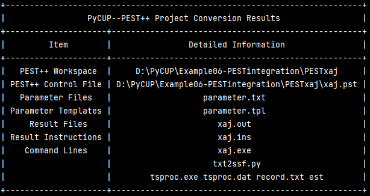
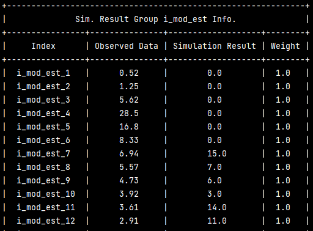

# Using pycup.integrate to integrate with PEST++

## Introduction

PEST++ is a well-know model-agnostic calibration software tool, which has a lot of convenient functions and a powerful parameter/simulation results IO framework. The current version of PyCUP supports a conversion of a well constructed PEST++ project to a PyCUP calibration project. In other words, Users can use the PEST++ IO operations to build up the objective function needed by PyCUP without writing the cumbersome IO functions by themselves. Also, this integration allows a comparison between the algorithms implemented by PyCUP and PEST++. However,  as the algorithms in PyCUP have different mechanisms, a few settings in PEST++ projects will be invalid.

## Potential Dependencies 

1. prettytable
2. subprocess
3. multiprocessing

## Relevant Software 

1. PEST++ (https://www.usgs.gov/data/pest-version-50-source-code-pre-compiled-binaries-and-example-problem)
2. tsproc.exe(https://www.usgs.gov/software/tsproc-a-general-time-series-processor-assist-model-calibration-and-result-summarization)

## Usage

### A simple demo

The following codes shows how to use the conversion function. All the related paths used in .pst file, .bat file, and .dat file, are recommended to be <u>**relative paths**</u>. The calibration/validation/prediction results,observations, and weights will be stored in a pycup.ResLib.SimulationResult() object. When extracting the result, use the model output data name(“i_mod_est” in the example) as the first index and use "simulation results", "observations", and "weights", as the secondary index respectively.

```python
import pycup
from pycup import PESTconvertor

# r"PESTxaj" the PEST++ project folder
con = PESTconvertor(r"PESTxaj")
# Print the conversion information in a table view
con.show_task_info()
con.show_parameter_info()
# Run the pycup calibration
pycup.GLUE.runMP(50,con.dim,con.lb,con.ub,con.objfun,n_jobs=5)
# Check the result
pycup.Reslib.UseResObject = True
res = pycup.save.RawDataSaver.load(r"RawResult.rst")
print(res.historical_results["i_mod_est"]["simulation results"])
print(res.historical_results["i_mod_est"]["observations"])
```




### PESTconvertor.\_\_init\_\_() method

This method is used to create an object of the PESTconvertor class. The mandatory argument is the directory of the PEST++ project folder. When the PEST control file (.pst) is absent, if the optional argument bat_fname (for example: calibrate.bat) is given, the program will automatically search the tsproc.exe command in it to generate a PEST control file.

### PESTconvertor.convert() method

The core method of the PESTconvertor is PESTconvertor.convert(). In addition to the simple demo shown above, this method also supports different settings:

```python
con = PESTconvertor(r"PESTxaj")
con.convert(mpi=True,mpimode="fixed",evaluation_metric=pycup.evaluation_metrics.OneMinusNSE,
            n_jobs=5,hide=True)
```

The optional arguments include:

1. **mpi:** The switch of multi-processing objective function. False as default. If True, the multi-processing version of the objective function will be generated. This function can then be used by .runMP functions of PyCUP algorithms (e.g. pycup.MFO.runMP)
2. **return_metric:** True as default, if False, the return value of the generated objective function will not contain the evaluation metric. The function without and evaluation metric can be used by pycup.utilize.Predictor for a prediciton process.
3. **hide:** Hide the commandline output, True as default.
4. **evaluation_metric:** The evaluation metric computing function, None as default. If None, the summation of the square of weighted residuals sum((wi*ri)**2), which is default in PEST++, will be used. See also the PEST++ documentation. Besides, PyCUP supports using the evaluation metrics in this package or a customized evaluation metric as a substitution, the calculation of these metrics can also partially consider the weight settings in PEST++, see also section <u>Commonness and Differences</u> in this documentation. For a multi-objective calibration, use a list of evaluation metric function as the argument, the returned objective can then be used by PyCUP multi-objective algorithms. For example: evaluation_metric=[pycup.evaluation_metrics.OneMinusNSE, pycup.evaluation_metrics.RMSE]. If a customized objective function is given, please make sure that the function receives two arguments, the first should be the observation series, the second should be the simulation result series, the returned value can only be a single value.
5. **mpimode:** This argument is only valid when mpi == True. Two modes including "dynamic" and "fixed" are accepted. If "dynamic", The program will create unfixed number of sub-folders and name them according to the system pid. After each simulation, the folder will be dynamically deleted. This mode allow users to use a lot of processes during the calibration task. If "fixed", the program will create the fixed number(n_jobs) of sub-folders. During the calibration process, the new simulation result will be overwritten in the current existing folder. This mode can avoid the problem that the folder are frequently created and deleted, which is faced with the "dynamic" mode. However, this mode only supports no more than 10 processes.
6. **n_jobs:** Number of processes, this is only valid when the mpimode is "fixed".

### PESTconvertor.show_task_info() method

This method is provided to briefly show the conversion result of the calibration task. It can be used after the PESTconvertor.convert() has been called.

### PESTconvertor.show_parameter_info() method

This method is provided to show the target parameter information of the calibration task. It can be used after the PESTconvertor.convert() has been called. The parameter name, lower boundary, upper boundary, group information, and whether they will be included in the calibration process will be shown.

### Other PESTconvertor methods

The following methods provided by PESTconvertor can be used independently to be a part of the customized objective function, although they will be automatically called by the PESTconvertor.convert().

| Method Name                  | Description                                                  |
| :--------------------------- | ------------------------------------------------------------ |
| PESTconvertor.gen_call()     | Returning a commandline calling function according to the settings in PEST .pst control file. |
| PESTconvertor.gen_objfun()   | Returning an objective function (including param IO, result IO, and cmd calling functions), which is same as PESTconvertor.objfun. |
| PESTconvertor.gen_paramIO()  | Returning a parameter updating function according to the parameter files and their templates. |
| PESTconvertor.gen_resultIO() | Returning a simulation result reading function.              |

For example, to read the reault:

```python
import pycup
from pycup import PESTconvertor

# r"PESTxaj" the PEST++ project folder
con = PESTconvertor(r"PESTxaj")
resfun = con.gen_resultIO()
# optional argument subfolder: sub-folder name if there is a subfolder/directory
list_result = confun()
print(list_result[0])
```



In the returned value of this function, the simulation results corresponding to the simulation group will be given separately. The elements in it are pycup.PESTclasses.PESTsimgp objects for storing simulation group results. The features of it include:

1. **PESTsimgp.gpname**: simulation result series name in PEST++
2. **PESTsimgp.obs**: the observation values corresponding to the simulation results.
3. **PESTsimgp.res**: a list if the simulation result data.
4. **PESTsimgp.idx**: simulation result data name in PEST++

### PESTconvertor Features/Attributes

After calling the .convert() method, the PESTconvertor object has the following attributes:

| Feature/Attribute Name          | Type                           | Description                                                  |
| ------------------------------- | ------------------------------ | ------------------------------------------------------------ |
| PESTconvertor.workspace         | string                         | The workspace directory of the PEST project.                 |
| PESTconvertor.obs               | pycup.PESTclasses.PESTobs      | Observation saving object with an saver object-> observation group object->data triple level structure. It support both a dictionary like indexing and iterative indexing. |
| PESTconvertor.cmd               | list                           | A list of recognized command lines.                          |
| PESTconvertor.n_jobs            | int                            | Number of processes when the mpi mode is "fixed".            |
| PESTconvertor.lb                | np.ndarray                     | The generated lower search boundary.                         |
| PESTconvertor.ub                | np.ndarray                     | The generated upper search boundary.                         |
| PESTconvertor.dim               | int                            | The dimension of the search space (len(lb)).                 |
| PESTconvertor.mode              | string                         | The multi-processing function type.                          |
| PESTconvertor.bat_fname         | string                         | The name of the user defined batch file (with the tsproc.exe command) when the .pst file is absent. |
| PESTconvertor.CallExe           | function                       | The executable calling function.                             |
| PESTconvertor.cmd_hide          | string                         | The "hide cmd output" option indicator.                      |
| PESTconvertor.evaluation_metric | None/function/list of function | The user defined evaluation metric function.                 |
| PESTconvertor.io_pairs          | pycup.PESTclasses.PESTio       | The object containing the template/parameter and instruction/output dictionaries. |
| PESTconvertor.mpi               | bool                           | The multiprocessing setting indicator.                       |
| PESTconvertor.objfun            | function                       | The generated objective function needed by pycup algorithms. |
| PESTconvertor.param             | pycup.PESTclasses.PESTparams   | The parameter information saver with an object->parameter group information->parameter information triple level. |
| PESTconvertor.tar_pars          | list                           | A list containing the target parameter (the "none" type or "log" type in PEST parameter information) information saved in a pycup.PESTclasses.PESTpar object. |
| PESTconvertor.oth_pars          | list                           | A list containing other parameters (the "fixed" type or "tied" type in PEST parameter information) . |

## Commonness and Differences

As the PyCUP and PEST++ use different algorithms/methods for model calibration, not all of the project settings in PEST++ can be considered by PyCUP, however, PyCUP and pycup.integrate.PESTconvertor still maintains most of the common features.

### Commonness 

1. Parameter definition: The parameter definition in PEST++ with a parameter group -> parameter data structure is remained the same. The parameter types including "none", "fixed", "tied" are implemented. 
2. Parameter template: The parameter IO operations in PEST++ with parameter template files are completely adopted.
3. Result instruction: The result IO operations PEST++ with instruction files are completely adopted.
4. PEST control file: PEST-PyCUP conversion is mainly based on the PEST++ control file in the project folder, while the tsproc.exe is also supported.
5. Evaluation metric/Objective function: The objective function generated by PEST-PyCUP conversion uses the default objective function in PEST++ as default, the weight of the observation series is also supported.

### Differences

1. Parameter definition: The parameter group settings for example, INCTYP, DERINC, DERINCLB, and FORCEN are not well implemented as a result of the difference calibration method. Algorithms in PyCUP do not need to calculate the derivative. When an INCTYP of "absolute"  is set, the parameter values written in parameter files will be adjusted to the integral multiple of the DERINC. This can be used by the PyCUP algorithm when the fixed increment is needed. However, the algorithm generated sample values stored in the RawDataSaver object will still be the original value.

2. PEST control file: external parameter data and external parameter group data in currently not implemented, this function will be updated in the near future. The lines start with "++" marker will not be read by the program.

3. Evaluation metric/Objective function: PyCUP supports the user defined evaluation metric in the objective function. In this situation, the weights of the observation data are still partially supported. For a user defined objective function, there are three kinds of acceptable observation weight series:

   <1> Weighted average: The weight remains constant in a observation data series, while different observation series can have different weights. In this case, the weighted averaged evaluation metric will be calculated, for example (a weighted averaged  RMSE can be calculated using 0.3 * RMSEseries1 + 0.7 *RMSEseries2). 

   <2> Drop out values: When the weights of a series are only 0 and 1, the data with a weight of 0 will be treated as the dropped out data and will not be included in the calculation of the final evaluation metric.

   <3>Weighted average with drop out values: When the weights of a series are only 0 and a unique value other than 0, the data with a weight of 0 will be treated as the dropped out data and will not be included in the calculation of the final evaluation metric, while the unique non-zero weights of different series will be used to calculate a weighted average metric.

4. Algorithms: the algorithms in PyCUP are mainly heuristic algorithms without complex prior information, therefore, the prior information section in PEST++ control file will not be implemented. The aim of the development of this conversion module is to use the PEST++ IO framework for a more convenient and model-agnostic calibration process. 